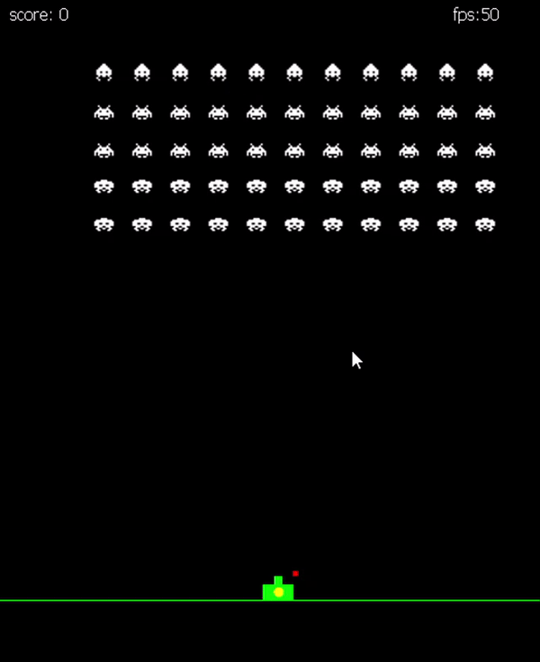

# [A lógica do Jogo](https://github.com/logicadojogo/)
Esse é um repositório com fins educacionais do livro "A Lógica do Jogo" de Marcus Becker, que, usando a linguagem **Java**, será produzido os seguintes Projetos:
* **Protótipo (finalizado)** 
* **Space Inviders (finalizado)** 

* **Ping-Pong**
* **Jogo da Cobrinha**
* **Tetris**
* **Pac-Man**
* **Asteroids**

